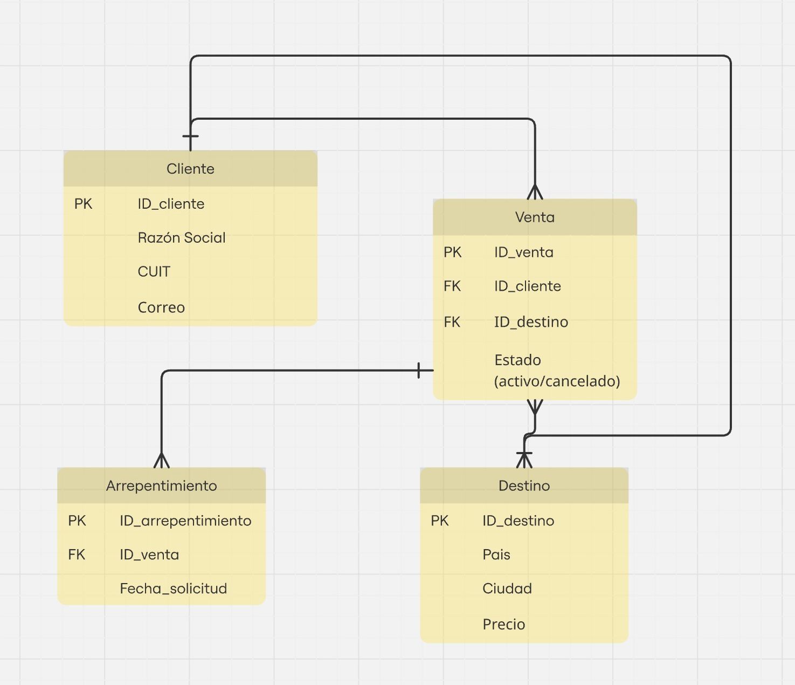

# SkyRoute - Sistema de Gestión de Pasajes Aéreos ✈️
# Proyecto académico - TSCDeIA 2025

Este proyecto es un **prototipo académico** de una aplicación de consola desarrollado como parte de la Evidencia 2 del módulo **Programador** en la carrera TSCDeIA 2025. Permite simular la gestión básica de ventas de pasajes para una agencia ficticia.

---

## 👩‍💻 Autores
 
- Juan Martin Rosello dal molin 
- Erica Melisa Paredes  
- Pablo Francisco Elías 
- Florencia Belén Dussman 
- Lisi Daniela Gonzalez
---

## 📌 Funcionalidades Principales

- Registro y gestión de **clientes** (razón social, CUIT, correo).
- Registro y gestión de **destinos** (ciudad, país, costo base).
- Registro de **ventas de pasajes**, asociando cliente, destino y fecha.
- Visualización de ventas, filtradas por cliente, destino o estado.
- **Botón de arrepentimiento:** permite anular una venta reciente dentro de los 60 días hábiles, cambiando su estado a "Anulada".

---

## 🛠️ Requisitos

- Python 3.9 o superior
- Terminal compatible (CMD, PowerShell, Bash o Terminal de VSCode)

---

## ▶️ ¿Cómo ejecutar el programa?

1. Descargá o cloná el repositorio.
2. Abrí una terminal en la carpeta del proyecto.
3. Ejecutá el archivo principal:

```bash
python main.py
```

---

## 💡 Notas importantes

- Si tu teclado no permite ingresar el símbolo `@`, podés usar `[arroba]` al ingresar correos y el sistema lo reemplazará automáticamente.
- Toda la información se mantiene en memoria (listas y diccionarios), ya que este es un prototipo sin conexión a base de datos real.

---
## 🗺️ Diagrama Entidad-Relación

A continuación se muestra el modelo ER del sistema de gestión de pasajes:

    
## Ética y Ejercicio Profesional

### Relación Legal y Responsabilidad Profesional del Grupo Desarrollador
Desde el punto de vista legal, el grupo de estudiantes que desarrolla el sistema para SkyRoute S.R.L. puede ser considerado como prestador de servicios bajo un contrato temporal, educativo o de colaboración, sin que exista una relación laboral de dependencia.

El grupo actúa como una unidad de prestación de servicios independiente, en calidad de colaboradores externos o contratistas, sin necesidad de conformar una entidad jurídica formal. Esto se enmarca dentro del principio de autonomía de la voluntad (Artículo 958 del Código Civil y Comercial de la Nación), que habilita a las partes a establecer acuerdos voluntarios y legítimos.

### Relación contractual con SkyRoute S.R.L.
La relación entre el grupo y la empresa es la de un contrato de prestación de servicios, donde el grupo entrega un producto funcional (el sistema de software) a cambio de una contraprestación académica o simbólica. Esta prestación no implica jornada laboral, ni subordinación, ni relación de dependencia, en línea con lo establecido por el Artículo 1251 del Código Civil y Comercial.

###  Obligaciones éticas y legales del grupo
Cada integrante del grupo tiene la responsabilidad de:

Respetar la confidencialidad de los datos e información proporcionados por la empresa, en concordancia con la Ley 25.326 de Protección de los Datos Personales, que obliga al resguardo de la información y prohíbe su uso no autorizado.

Entregar la documentación y el código fuente desarrollado hasta el momento en caso de ser solicitado por la empresa, en cumplimiento del principio de buena fe contractual (Artículo 961 del CCyCN).

Propiedad de los datos y del software
Los datos utilizados en el sistema (como clientes, destinos, ventas, etc.) son propiedad de SkyRoute S.R.L., ya que han sido provistos o generados en el marco de su operación comercial.

El código fuente del sistema desarrollado constituye una obra intelectual protegida por la Ley 11.723, por lo cual los derechos de autor pertenecen al grupo desarrollador.

SkyRoute puede disponer del sistema mediante un derecho de uso, siempre y cuando se acuerde previamente entre las partes. Esto es habitual en entornos de desarrollo freelance o educativo, donde se respeta la propiedad intelectual pero se autoriza su utilización.

### Botón de Arrepentimiento
La implementación del Botón de Arrepentimiento en el sistema responde al cumplimiento de la Ley 24.240 de Defensa del Consumidor y la Resolución 424/2020 de la Secretaría de Comercio Interior, que exige a los proveedores ofrecer un medio digital claro y accesible para que el consumidor pueda revocar una compra sin penalidades.

En el caso del transporte aéreo, el plazo para ejercer este derecho se extiende hasta 60 días hábiles desde la compra, en conformidad con la normativa vigente y prácticas del sector. Este botón debe estar visible, accesible y operativo, y su inclusión en el sistema garantiza tanto el cumplimiento legal como la transparencia en la relación empresa-cliente.

